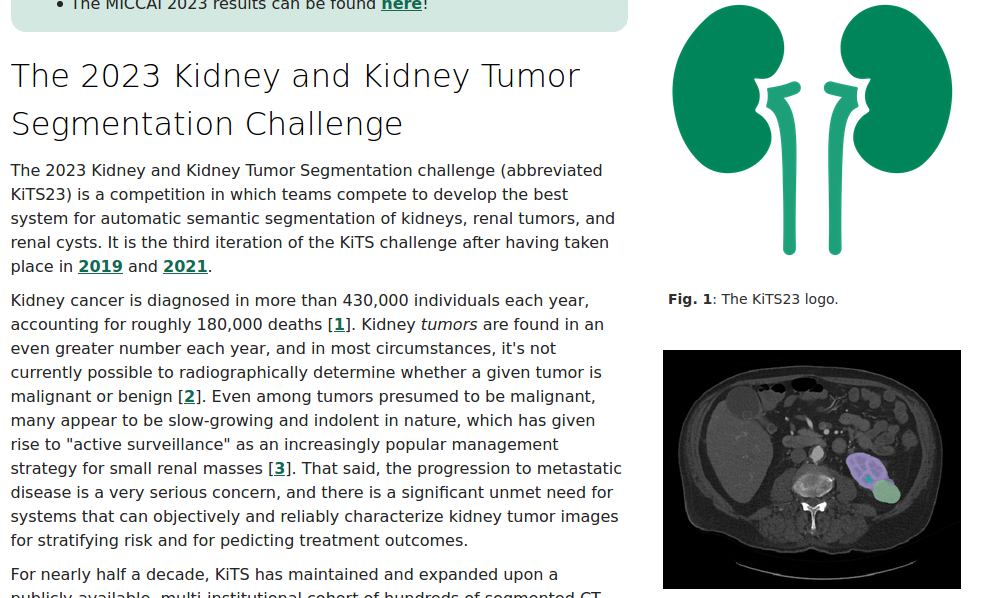
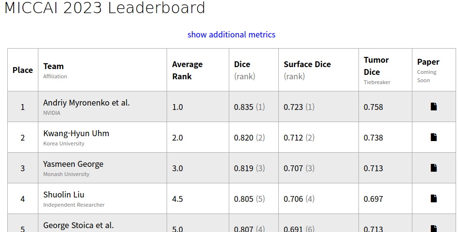

# MICCAI2023-KiTS23 Challenge 2nd-place

2nd place of the [KiTS23](https://kits-challenge.org/kits23/) Challenge (Kidney and Kidney Tumor Segmentation Challenge).

Kwang-Hyun Uhm, Hyunjun Cho, Zhixin Xu, Seohoon Lim, Seung-Won Jung, Sung-Hoo Hong, and Sung-Jea Ko

Korea University <br> The Catholic University of Korea, Seoul <br> MedAI

## Overview

## Leaderboard


# Instructions for KiTS23 Challenge submission

Our container is built on top of [nnUNet](https://github.com/MIC-DKFZ/nnUNet) framework.

For installation guide, dataset conversion, data preprocessing, training, and inference of 3D U-Net, we refer to [nnUNet](https://github.com/MIC-DKFZ/nnUNet) .

## Training
We train three 3D U-Nets under different training configurations, which can be manually configured in nnUNetPlans.json file.
(Dataset_ID: 500 for training data)
1. Lowres: "UNet_class_name": "PlainConvUNet", "batch_size": 2 
```bash
nnUNetv2_train 500 3d_lowres all 
```
2. Lowres - residual: "UNet_class_name": "ResidualEncoderUNet", "batch_size": 2
```bash
nnUNetv2_train 500 3d_lowres all 
```
3. Fullres - batch 4: "UNet_class_name": "PlainConvUNet", "batch_size": 4
```bash
nnUNetv2_train 500 3d_fullres all 
```

The pretrained models can be found in "pretrained_models" directory.

## Inference
get inference results for test data for all models (Dataset_ID: 700 for test data)

1. Lowres: "UNet_class_name": "PlainConvUNet", "batch_size": 2 
```bash
nnUNetv2_predict -i INPUT_FOLDER_for_Lowres -o OUTPUT_FOLDER_for_Lowres -d 700 -c 3d_lowres
```
2. Lowres - residual: "UNet_class_name": "ResidualEncoderUNet", "batch_size": 2
```bash
nnUNetv2_predict -i INPUT_FOLDER_for_Lowres_Residual -o OUTPUT_FOLDER_for_Lowres_Residual -d 700 -c 3d_lowres
```
3. Fullres - batch 4: "UNet_class_name": "PlainConvUNet", "batch_size": 4
```bash
nnUNetv2_predict -i INPUT_FOLDER_for_Fullres_batch_4 -o OUTPUT_FOLDER_for_Fullres_batch_4 -d 700 -c 3d_fullres
```

## Post-processing
### Kidney
We first perform post-processing for kidney regions using the pairs of low- and full-resolution prediction results.
```bash
python nnUNetv2/custom/postprocess.py -l RESULT_FOLDER_of_Lowres -f RESULT_FOLDER_of_Fullres_batch_4 
python nnUNetv2/custom/postprocess.py -l RESULT_FOLDER_of_Lowres_Residual -f RESULT_FOLDER_of_Fullres_batch_4 
```
### Tumor
We then perform post-processing for tumor regions using the pairs of post-processed low- and full-resolution prediction results.
```bash
python nnUNetv2/custom/post_process_tumor.py -l Kidney_Post_Proccsed_FOLDER_of_Lowres -f Kidney_Post_Proccsed_FOLDER_of_Fullres_batch_4 
python nnUNetv2/custom/post_process_tumor.py -l Kidney_Post_Proccsed_FOLDER_of_Lowres_Residual -f Kidney_Post_Proccsed_FOLDER_of_Fullres_batch_4 
```
### Aggregation
We finally aggregate the two post-processed results to obtain final result.
```bash
python nnUNetv2/custom/majority_voting.py -i Tumor_Post_Proccsed_FOLDER_of_Fullres_Lowres_pair Tumor_Post_Proccsed_FOLDER_of_Fullres_Lowres_Residual_pair -o FINAL_OUTPUT_FOLDER
```


## Citation
> Uhm, KH. et al. (2024). Exploring 3D U-Net Training Configurations and Post-processing Strategies for the MICCAI 2023 Kidney and Tumor Segmentation Challenge. In: Heller, N., et al. Kidney and Kidney Tumor Segmentation. KiTS 2023. Lecture Notes in Computer Science, vol 14540. Springer, Cham. https://doi.org/10.1007/978-3-031-54806-2_2

